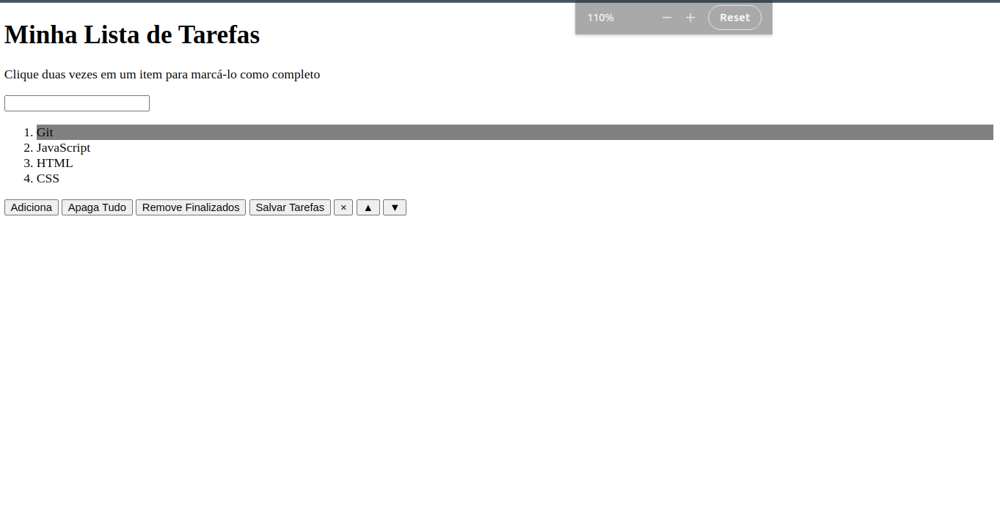

# Projeto Todo list
## 📋 Descrição do projeto
Um site onde se gerencia uma lista de tarefas. Com o uso de manipulação do DOM, LocalStorage, JavaScript onde o usuário pode adicionar, mover, excluir e marcar tarefas.

## 📷 Screenshot

## 💻 Tecnologias utilizadas
- JavaScript
- HTML
- CSS
- DOM
- LocalStorage

## 🎓 Aprendizados
- Manipular o DOM.
- Manipular o Javascript.
- Manipular o LocalStorage.
- Manipular o CSS.

## 📈 Status do projeto
✅ Concluído

## 🚀 Links
- Site no ar: [Link](https://dogl4.github.io/todo-list/index.html)

## :busts_in_silhouette: Contribuintes
<table>

<tr  style="width:120px">

<td  align="center">

<a  target=”_blank”  href="https://github.com/Dogl4">

 

<b>Pedro Barreto</b>

</a>

</td>

</tr>

</table>
